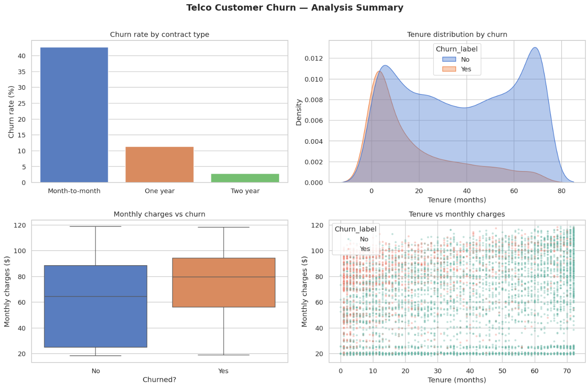

# 📉 Telco Customer Churn Analysis

### End-to-end churn analysis — SQL → Python → Statistics → ML Model → Power BI


---

## 📌 Project Overview

A full data analyst project analysing **7,043 telecom customers** to answer:
- **WHO** is churning?
- **WHY** are they leaving?
- **WHEN** in their lifecycle does churn happen?
- Can we **PREDICT** who will churn next month?

**Dataset:** [Telco Customer Churn — Kaggle](https://www.kaggle.com/datasets/blastchar/telco-customer-churn)

**Tools used:** MS SQL Server · pandas · numpy · scipy · seaborn · scikit-learn · Power BI

---

## 🔗 Live Dashboard

👉 **[View Power BI Dashboard](YOUR_POWERBI_LINK_HERE)**

---

## 📊 Dashboard Preview

### Page 1 — Executive Overview


### Page 2 — Segment Analysis


### Page 3 — Customer Risk Scores (ML)


---

## ❓ Business Questions & Findings

| # | Business Question | Finding |
|---|-------------------|---------|
| 1 | What is our churn rate? | **26.5%** — above 15–20% industry benchmark |
| 2 | Which contract type churns most? | Month-to-month: **42%** vs Two year: **3%** |
| 3 | Does internet service affect churn? | Fiber optic: **42%** (p < 0.001) |
| 4 | Is tenure difference statistically real? | Yes — 18mo (churned) vs 38mo (retained), p < 0.001 |
| 5 | How much MRR are we losing? | **~$139,000/month** (~$1.67M/year) |
| 6 | When do customers leave? | **50% of all churners leave before month 10** |
| 7 | Which combination is most dangerous? | Month-to-month + Fiber optic = **~54% churn** |
| 8 | Can we predict next month's churners? | Logistic Regression: **AUC 0.85, Accuracy 81%** |

---

## 💡 Key Findings

> 📋 **26.5% churn rate** — 1 in 4 customers leaving every month

> 📄 **Month-to-month contracts churn 14× more** than two-year contracts (42% vs 3%)

> 🌐 **Fiber optic customers churn at 42%** despite paying the highest monthly bills (~$91/month)

> ⏱️ **50% of churners leave before month 10** — first year is the danger zone

> 💸 **~$1.67M annual revenue** lost to churn

> 🤖 **ML model (AUC 0.85)** identifies high-risk customers — output: ranked retention call list

---

## 📈 Charts



---

## 🏗️ Project Structure

```
telco-churn-analysis/
├── data/
│   ├── churn_cleaned.csv              # Cleaned dataset (7,043 rows)
│   └── data_dictionary.md            # Column descriptions
├── sql/
│   └── churn_queries.sql             # 14 SQL queries with business context
├── notebooks/
│   ├── 01_data_cleaning.ipynb        # pandas + numpy — cleaning
│   ├── 02_eda_and_charts.ipynb       # seaborn + matplotlib — EDA
│   └── 03_stats_and_ml_model.ipynb   # scipy + scikit-learn — stats + ML
├── charts/                           # All exported PNG charts
├── powerbi/
│   ├── Telco_Churn_Dashboard.pbix    # Power BI file
│   └── screenshots/                  # Dashboard page screenshots
├── outputs/
│   ├── churn_risk_scores.csv         # ML risk scores for all active customers
│   └── high_risk_customers.csv       # High-risk retention call list
├── requirements.txt
└── README.md
```

---

## 🤖 ML Model Summary

| Metric | Value |
|--------|-------|
| Model | Logistic Regression |
| Train / Test split | 80% / 20% stratified |
| Test Accuracy | ~81% |
| AUC Score | ~0.85 |
| Top churn driver | Short tenure + Month-to-month contract |
| Deliverable | Ranked list of 5,174 active customers by churn probability |

---

## 💼 Business Recommendations

| Priority | Recommendation |
|----------|---------------|
| 🔴 High | Incentivise month-to-month customers to upgrade to annual contracts |
| 🔴 High | Launch first-year onboarding programme — intervene before month 10 |
| 🔴 High | Investigate Fiber optic pricing and service quality |
| 🟡 Medium | Offer auto-pay discounts to reduce electronic check churn |
| 🟡 Medium | Senior citizen retention plan — 41% churn vs 24% average |
| 🟢 Low | Use ML risk scores to prioritise retention budget |

---

## ▶️ How to Run

```bash
# 1. Clone the repo
git clone https://github.com/rishabh-kumar-singh72/telco-churn-analysis.git

# 2. Install dependencies
pip install -r requirements.txt

# 3. Run notebooks in order in Google Colab or Jupyter
#    01_data_cleaning → 02_eda_and_charts → 03_stats_and_ml_model

# 4. For SQL: run churn_queries.sql in MS SQL Server (SSMS)
# 5. For Power BI: open Telco_Churn_Dashboard.pbix in Power BI Desktop
```

---

## 👤 About

**Rishabh Kumar Singh** | Data Analyst
Microsoft Certified: Associate Azure Administrator · PL-300 Power BI Analyst

[](www.linkedin.com/in/rishabh-kumar-singh-980999142)
[](https://github.com/rishabh-kumar-singh72)
